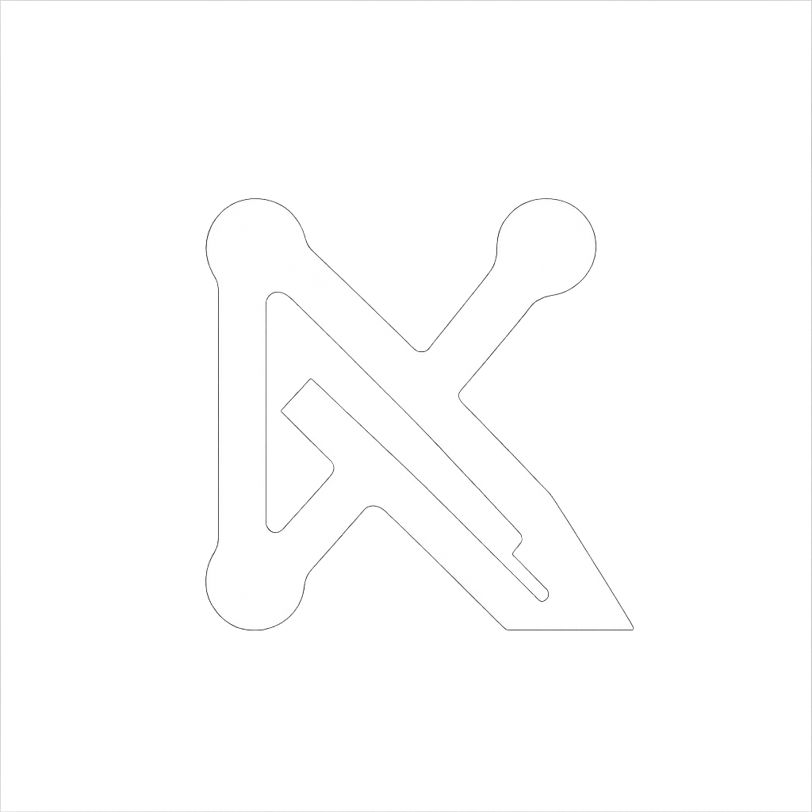

<p align="center">
  
</p>
<br />
<div align="center">
<h1 align="center">Nexo Landing</h1>

  <p align="center">
    A modern and intuitive web application built with Vue.js ✨
    <br />
    <a href="https://nexoappp.netlify.app/">Try it now</a>
  </p>
</div>

<!-- ABOUT THE PROJECT -->
## 📖 About The Project


**Nexo** is a clean, intuitive, and modern web application developed over the course of three months as the final project for a Web Programming and Design course in the [EOI school](https://www.eoi.es/es).

Nexo is a simple solution for project and task management. Organize your ideas, collaborate with your team, and track your progress intuitively and effectively.

### 🧰 Built With

- [![Vue][Vue.js]][Vue-url]
- [![HTML5][HTML]][HTML-url]
- [![CSS][CSS]][CSS-url]
- [![Javascript][JS]][JS-url]


## 🚀 Getting Started

To run this project locally, follow these simple steps.

### Prerequisites

You need to have [Node.js](https://nodejs.org/) and npm installed.

### Installation

1. Clone the repo
   ```bash
   git clone https://github.com/jnfrap/nexo.git
2. Go to the project directory
   ```bash
   cd nexo
3. Install dependencies
   ```bash
   npm install
4. Run the development server
   ```bash
   npm run dev
5. Open http://localhost:5173 in your browser

## 🌐 Live Demo

Try it out here:  
👉 [https://nexoappp.netlify.app/](https://nexoappp.netlify.app/)

---

## 👥 Team

This project was developed by a small team of students:

- **Javier** – [@J4v1Dev](https://github.com/J4v1Dev)  
- **Juan Francisco** – [@jnfrap](https://github.com/jnfrap)
- **Raúl** – [@raulmarcos99](https://github.com/raulmarcos99)

<!-- MARKDOWN LINKS & IMAGES -->
[Vue.js]: https://img.shields.io/badge/Vue.js-35495E?style=for-the-badge&logo=vuedotjs&logoColor=4FC08D
[Vue-url]: https://vuejs.org/
[HTML]: https://img.shields.io/badge/HTML5-E34F26?style=for-the-badge&logo=html5&logoColor=white
[HTML-url]: https://developer.mozilla.org/es/docs/Web/HTML
[CSS]: https://img.shields.io/badge/CSS3-1572B6?style=for-the-badge&logo=css3&logoColor=white
[CSS-url]: https://developer.mozilla.org/es/docs/Web/CSS
[JS]: https://img.shields.io/badge/JavaScript-F7DF1E?style=for-the-badge&logo=javascript&logoColor=black
[JS-url]: https://developer.mozilla.org/es/docs/Web/JavaScript